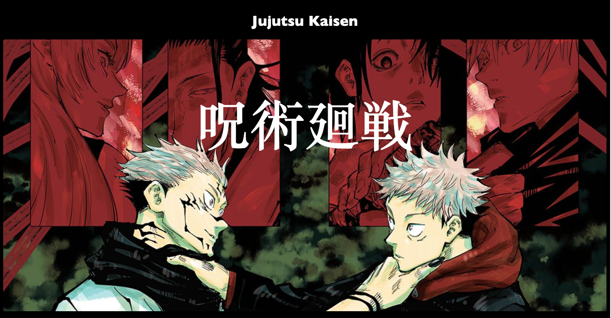
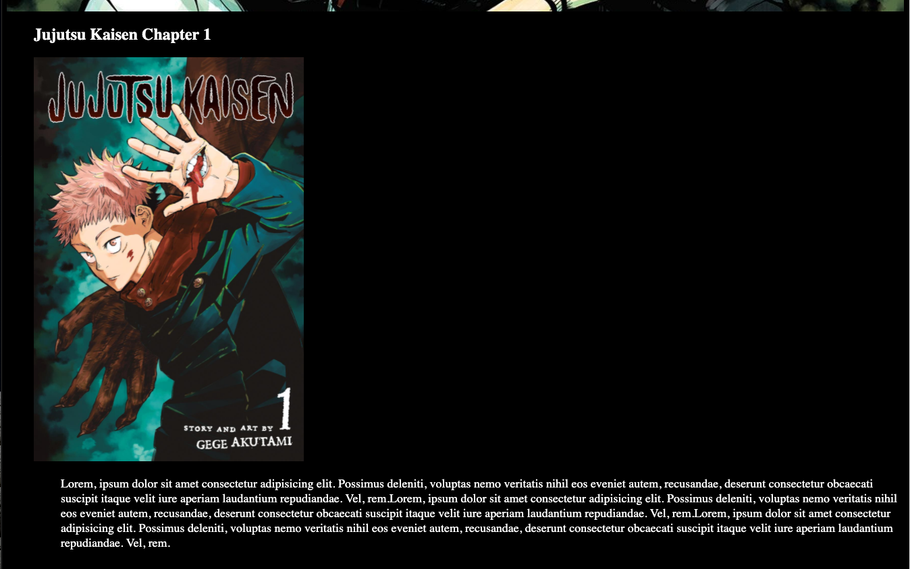
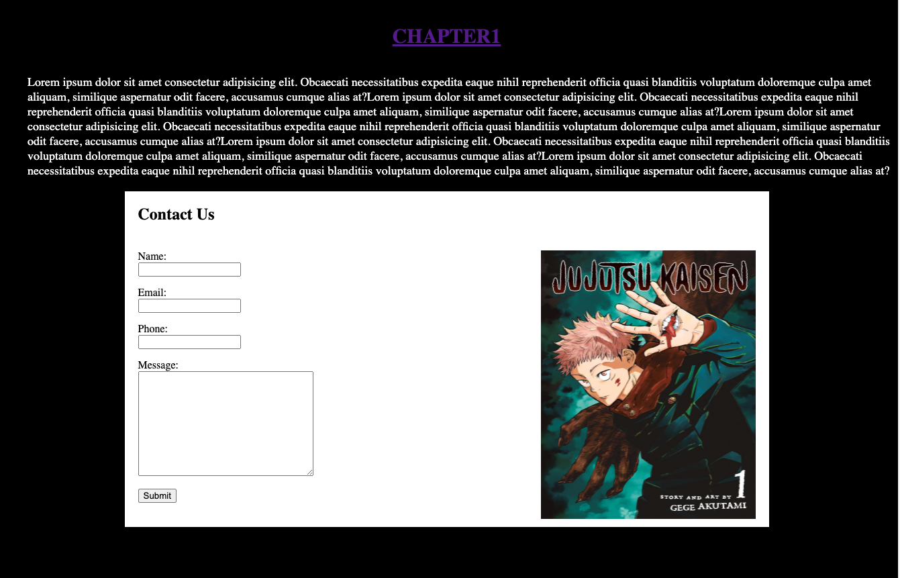

# Homework 1 - *Favorite Manga Website*

**First website template homework** - basic webpage built with only using HTML, and CSS.

Submitted by: **Jeffin Abraham**

Time spent: **3** hours spent in total.

## User Stories

* [x] User can **view the title page** of the manga before they start reading.
* [x] User can **contact us** using the survey form at the end of the webpage.

The following **optional** features are implemented:

* [x] User can **tap the "Chapter1" link** for a surprise.

## Walkthrough

Here's some screenshot of the webpage:

## Notes

First webpage built with Bay Valley Tech.
